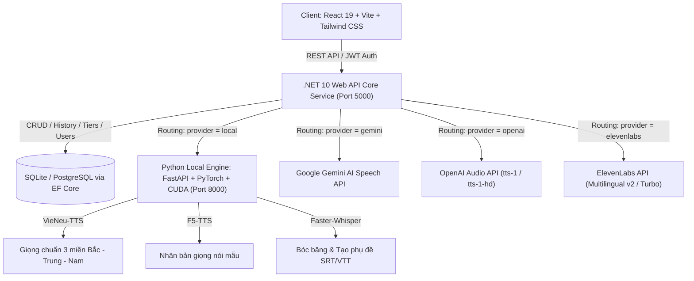

# Kiến Trúc Hệ Thống MinhTTS Studio (System Architecture)

## 1. Tổng Quan Hệ Thống (System Overview)

MinhTTS là nền tảng chuyển đổi văn bản thành giọng nói (Text-to-Speech), nhân bản giọng đọc (Voice Cloning) và tự động tạo phụ đề (Auto Subtitle Generation) đa luồng, hỗ trợ kết hợp giữa Cloud AI (Google Gemini, OpenAI, ElevenLabs) và Local AI Engine (VieNeu-TTS, F5-TTS, Faster-Whisper tăng tốc phần cứng GPU NVIDIA RTX CUDA).

---

## 2. Các Thành Phần Chính (Core Components)

### 2.1. Frontend Studio Layer (`/client`)
- **Framework**: React 19, TypeScript, Vite, Tailwind CSS v4, Lucide React icons.
- **Tính năng giao diện**:
  - **Studio TTS Tab**: Soạn thảo văn bản, đếm từ/ký tự theo thời gian thực, lựa chọn Nhà cung cấp (Gemini / OpenAI / ElevenLabs / Local), lựa chọn Model & Giọng đọc (kèm audio preview mẫu), điều chỉnh tốc độ đọc (0.1x – 2.0x), bộ gắn tag biểu cảm nhanh (`[whispers]`, `[laughs]`,...).
  - **Voice Cloning Tab**: Tải lên mẫu audio tham chiếu (Reference Audio 3–10s) và prompt text để nhân bản giọng tức thì với F5-TTS.
  - **Subtitle Editor Tab**: Trình nghe nhạc và đồng bộ phụ đề thời gian thực, chỉnh sửa từng câu/mốc thời gian, chia nhỏ, gộp dòng, tải lên file audio bất kỳ để bóc băng và xuất file chuẩn `.srt`, `.vtt`, `.json`.
  - **Audio Library Tab**: Quản lý lịch sử tạo giọng, nghe lại trực tiếp, tải file MP3/WAV, sao chép prompt cấu hình, xóa từng bản ghi hoặc xóa toàn bộ.
  - **API Keys Manager Tab**: Quản lý và lưu trữ mã khóa cá nhân (BYOK) cho Gemini, OpenAI, ElevenLabs trực tiếp trên LocalStorage, tự động kích hoạt chế độ miễn trừ hạn mức token.
  - **Admin Dashboard Tab**: Dành riêng cho Quản trị viên quản lý danh sách người dùng, xem thống kê số lượt chuyển đổi, phân bổ hạng gói (Free / Basic / Pro / Ultra) và cấu hình hạn mức từ / token theo từng gói.
- **Theme & Đa ngôn ngữ**: Hỗ trợ chuyển đổi Dark / Light mode mượt mà, hỗ trợ song ngữ Tiếng Việt (VI) và Tiếng Anh (EN).

### 2.2. Backend Gateway & Core Service (`/server`)
- **Công nghệ**: .NET 10 C# Web API (Clean Architecture).
- **Security & Authentication**:
  - Mã hóa mật khẩu bằng BCrypt (`BCrypt.Net-Next`).
  - Cấp phát và xác thực Token chuẩn JWT Bearer.
  - Hỗ trợ đăng nhập / liên kết tài khoản Google OAuth (`Google.Apis.Auth`).
  - Phân quyền theo vai trò (Role-based: `User`, `Admin`).
- **Database Context & ORM**:
  - Entity Framework Core với SQLite (`minhtts.db`) cho môi trường cục bộ và hỗ trợ PostgreSQL khi triển khai Cloud.
  - Quản lý các thực thể: `User`, `TtsHistory`, `TierConfig`, `SystemSetting`.
- **Dynamic TTS Routing Engine (`ITtsService`, `TtsServiceFactory`)**:
  - `GeminiTtsService`: Gọi trực tiếp Google Gemini AI Speech API, xử lý giải mã 16-bit 24kHz Linear PCM thành MP3.
  - `LocalTtsService`: Giao tiếp HTTP với Python Local Engine (`http://localhost:8000`), hỗ trợ VieNeu-TTS và F5-TTS Voice Cloning.
  - `OpenAiTtsService`: Tích hợp OpenAI Audio Speech API (`tts-1`, `tts-1-hd`).
  - `ElevenLabsTtsService`: Tích hợp ElevenLabs Text-to-Speech API (`eleven_multilingual_v2`, `eleven_turbo_v2_5`).
- **Subtitle & Transcription Service (`ISubtitleService`)**:
  - Xử lý chuyển đổi âm thanh sang phụ đề với Faster-Whisper thông qua Local Engine hoặc Gemini Audio STT.
  - Định dạng xuất chuẩn SRT, VTT và JSON.
- **Quota & Tier Enforcement Engine**:
  - Kiểm tra số từ mỗi lượt chuyển đổi theo cấu hình hạng (`MaxWordsPerRequest`).
  - Kiểm tra và cộng dồn số token sử dụng trong ngày (`DailyTokensUsed` vs `DailyTokenLimit`).
  - Tự động Reset số token đã dùng mỗi ngày.
  - Miễn trừ kiểm tra token khi request chứa API Key cá nhân của người dùng (BYOK).

### 2.3. Python ML Engine (`/python-engine`)
- **Framework**: FastAPI, Uvicorn, PyTorch, ONNX Runtime GPU (`onnxruntime-gpu 1.24.1`).
- **Phần cứng**: NVIDIA GeForce RTX 3060 Laptop GPU (6GB VRAM, CUDA 12.6, CuDNN 9.x).
- **Mô hình AI tích hợp**:
  - **VieNeu-TTS v3 Turbo**: Mô hình giọng đọc tiếng Việt chất lượng cao với 6 giọng chuẩn (Bắc, Trung, Nam).
  - **F5-TTS**: Mô hình Voice Cloning không cần huấn luyện lại (Zero-shot Voice Cloning) dựa trên Flow Matching.
  - **Faster-Whisper**: Mô hình nhận dạng giọng nói và bóc băng phụ đề siêu tốc độ với độ chính xác cao.

---

## 3. Quy Trình Xử Lý Dữ Liệu (Data Flows)

### 3.1. Quy trình Chuyển đổi Văn bản thành Giọng nói (TTS Pipeline)
1. **Client** gửi `POST /api/tts/generate` kèm theo `text`, `model`, `voice`, `speed`, `provider`, `apiKey` (tùy chọn) và `autoGenerateSubtitles` (tùy chọn).
2. **Backend Authentication & Quota Middleware**:
   - Xác thực người dùng qua JWT.
   - Kiểm tra giới hạn số từ theo hạng gói (`User.Tier`).
   - Nếu không có `apiKey` cá nhân, kiểm tra xem `DailyTokensUsed + estimatedTokens <= DailyTokenLimit` hay không.
3. **TTS Dispatcher**:
   - Chuyển tiếp request đến Service tương ứng: `LocalTtsService` / `GeminiTtsService` / `OpenAiTtsService` / `ElevenLabsTtsService`.
4. **Audio Processing**:
   - Nhận luồng âm thanh hoặc PCM nhị phân, mã hóa thành MP3/WAV.
   - Lưu trữ bản sao vào thư mục `App_Data/audio_library/` và tạo bản ghi trong bảng `TtsHistories`.
5. **Auto-Subtitles (Tùy chọn)**:
   - Nếu `autoGenerateSubtitles = true`, tự động gọi module Whisper STT để tạo danh sách segments phụ đề kèm mốc thời gian.
6. **Response**: Trả về base64 audio, thời lượng, số token đã tiêu thụ và danh sách phụ đề cho Client.

### 3.2. Quy trình Nhân bản Giọng nói (Voice Cloning Pipeline)
1. **Client** gửi `POST /api/tts/clone-voice` (Multipart form-data: file âm thanh mẫu `.wav`/`.mp3` + `text` + `speed`).
2. **Backend** kiểm tra quyền người dùng và chuyển tiếp file nhị phân sang Python Local Engine `http://localhost:8000/clone-voice`.
3. **Python Engine** tải audio mẫu vào bộ nhớ đệm PyTorch Tensor (không cần ghi ra file tạm trên ổ đĩa), trích xuất Speaker Embedding với F5-TTS và tổng hợp âm thanh giọng mới theo văn bản đầu vào.
4. **Backend** lưu lịch sử và trả về audio đã nhân bản cho Client.

### 3.3. Quy trình Bóc băng & Biên tập Phụ đề (Subtitle Generation & Editing)
1. **Tạo phụ đề từ Audio**:
   - Người dùng tải lên tệp âm thanh hoặc hệ thống tự động gọi sau khi TTS.
   - Backend gọi `POST /api/subtitles/transcribe` sang Local Engine Faster-Whisper.
   - Whisper phân tích âm thanh, nhận diện ngôn ngữ và trả về danh sách các segments gồm `id`, `start_time`, `end_time`, `text`.
2. **Biên tập trực quan trên Client**:
   - Người dùng xem phụ đề trên Subtitle Editor.
   - Thêm câu mới, xóa câu, sửa text, điều chỉnh thời gian bắt đầu/kết thúc.
   - Phát âm thanh đồng bộ: Audio phát đến đâu, dòng phụ đề tương ứng được highlight và cuộn tự động vào tầm nhìn.
3. **Xuất tệp**:
   - Client có thể gọi `POST /api/subtitles/export` hoặc tải trực tiếp file `.srt`, `.vtt`, `.json` do client sinh ra hoặc backend định dạng.

---

## 4. Bảo Mật & Quản Lý Tài Nguyên (Security & Performance)
- **CORS Policy**: Cấu hình mở cho phép Client SPA truy cập an toàn.
- **Hệ thống Cache & Tối ưu GPU VRAM**:
  - Python Engine tự động giải phóng bộ nhớ CUDA sau mỗi phiên tổng hợp lớn.
  - Tận dụng FP16 (Half Precision) trên kiến trúc NVIDIA Ampere để tăng gấp đôi tốc độ xử lý và giảm 50% dung lượng VRAM tiêu thụ.
- **Bảo mật API Key BYOK**:
  - Khóa API của người dùng chỉ được lưu trên LocalStorage của trình duyệt và gửi qua header HTTPS an toàn theo từng request, Backend không bao giờ lưu trữ khóa của người dùng vào Database.
